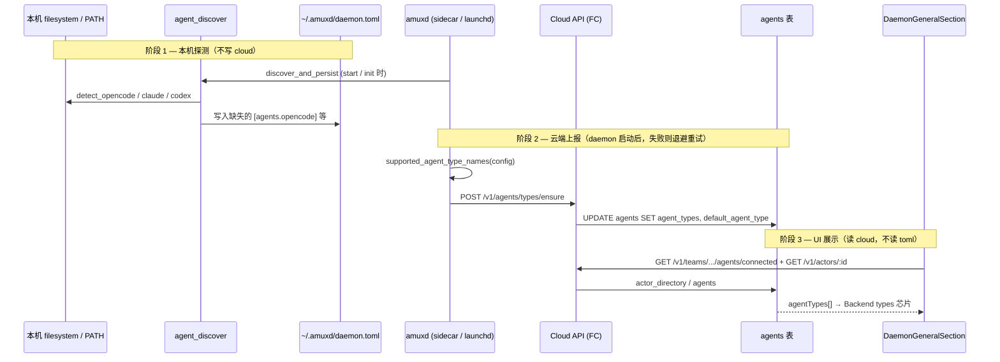

# Agent Backend 探测与云端上报流程

> 状态：说明文档（2026-06-11）  
> 背景：Settings → Daemon → General 中 **Backend types** 显示  
> *"This daemon has not advertised any backend types yet."*，  
> 但本机已安装 opencode，且 `~/.amuxd/daemon.toml` 里可能已有 `[agents.*]` 配置。

本文梳理 **三条独立链路**：本机探测、云端上报、UI 展示。  
三者常被误认为是一回事，实际上可以不同步。

---

## 1. 总览：三个「真相来源」

| 层级 | 数据来源 | 回答的问题 | 典型路径 |
|------|----------|------------|----------|
| **A. 本机配置** | `~/.amuxd/daemon.toml` 的 `[agents.*]` | amuxd **能启动**哪些 runtime？ | `agent_discover` / `amuxd doctor` |
| **B. 云端元数据** | Supabase `agents.agent_types` | 团队其他成员 / UI **认为**该 agent 支持什么？ | `POST /v1/agents/types/ensure` |
| **C. 设置页 UI** | Cloud API 读 `agents` 行（经 `actor_directory`） | 用户在 General 里看到什么？ | `getLocalDaemonAgent()` → `agentTypes` |

**关键结论：**

- A 成功 **不等于** B 成功。
- UI 只看 **B**，不看 `daemon.toml`。
- 因此会出现：本机已探测到 opencode，设置页仍显示「尚未 advertise」。

---

## 2. 流程图（端到端）



---

## 3. 阶段 A — 本机 Agent 探测

### 3.1 触发时机

| 时机 | 代码入口 | 是否持久化 |
|------|----------|------------|
| `amuxd start` | `main.rs` → `agent_discover::discover_and_persist` | 是（改 `daemon.toml`） |
| `amuxd init`（onboarding） | `onboarding/init.rs` → `discover_and_merge` + save | 是 |
| 手动 | `amuxd doctor`（只读 JSON） | 否 |

可通过 `AMUXD_NO_AUTO_DISCOVER=1` 或 `daemon.toml` 里 `[agents] auto_discover = false` 关闭。

### 3.2 探测策略（`apps/daemon/src/agent_discover/mod.rs`）

- 只 **补全** 缺失的 `[agents.*]`，**不覆盖**已有段。
- 顺序：opencode → claude_code → codex。
- Cloud 默认 backend 命名策略（option 3）：若支持列表含 opencode，则 `default_agent_type` 优先 opencode（见 `default_advertised_agent_type`）。

### 3.3 opencode 解析顺序（`opencode_install/mod.rs`）

1. `daemon.toml` 里显式配置的 `binary`（非空且不是 serde 默认占位 `"claude"`）
2. **`~/.opencode/bin/opencode`**（官方安装路径，绝对路径，供 launchd 无 PATH 场景）
3. 回退字符串 `"opencode"`（依赖 PATH；sidecar/foreground 通常可用）

`detect_opencode()` 在上述路径找到二进制后，还需 `--version` 成功才视为 present。

### 3.4 本机验收命令

```bash
# 只读检测（不依赖 daemon 进程）
amuxd doctor | jq '.opencode'

# 看持久化结果
grep -A2 '\[agents.opencode\]' ~/.amuxd/daemon.toml
```

**若 doctor 显示 opencode present，且 daemon.toml 有 `[agents.opencode]`，则阶段 A 已成功。**  
这与 Settings 页 Backend types **无关**。

### 3.5 开发模式注意点

| 场景 | 行为 |
|------|------|
| `pnpm tauri:dev` | sidecar 在 `apps/desktop/binaries/amuxd-<target>`，**不**自动复制到 `~/.amuxd/bin/amuxd` |
| `cargo run -p amuxd -- start` / `scripts/amuxdctl.sh` | 直接用 `target/debug/amuxd`，同样会跑 `discover_and_persist` |
| `--skip-setup` | 跳过首启向导的「复制 amuxd 到 ~/.amuxd/bin」，**不**跳过 agent_discover |

开发模式下 amuxd 从源码启动 **不影响** opencode 探测逻辑；探测读的是 filesystem/PATH，不是 sidecar 路径。

---

## 4. 阶段 B — 云端 Backend Types 上报

### 4.1 何时触发

`DaemonServer::run()` 启动后，后台 **spawn 一次**（当前实现）：

```text
supported_agent_types = supported_agent_type_names(&config)
default_agent_type    = default_advertised_agent_type(&supported_agent_types)
backend.ensure_agent_types(supported_types, default_agent_type)
  → POST /v1/agents/types/ensure
```

`supported_agent_type_names` 与 `daemon.toml` 中 **已配置** 的段一致：

| daemon.toml 段 | 上报名 |
|----------------|--------|
| `[agents.claude_code]` | `claude` |
| `[agents.opencode]` | `opencode` |
| `[agents.codex]` | `codex` |
| 全空 | 回退 `["claude"]` |

### 4.2 Cloud API 契约

- **OpenAPI**：`POST /v1/agents/types/ensure`
- **Body**：`{ supportedTypes: string[], defaultAgentType: string }`
- **认证**：daemon 的 refresh token → access token（Bearer）
- **持久化**：`agents.agent_types`（jsonb 数组）、`agents.default_agent_type`

### 4.3 FC 实现路径

| BACKEND_KIND | 实现 | 更新哪一行 |
|--------------|------|------------|
| `supabase`（默认） | `services/fc/src/lib/supabase-repo.ts` → `ensureAgentTypes` | `agents` 表 |
| `postgres` | `services/fc/src/lib/pg-repo/agents.ts` → `ensureAgentTypes` | 同上，用 `ctx.callerActorId` |

### 4.4 RLS / 谁能改 `agents` 行

Daemon 更新自身 row 依赖 Postgres policy，例如：

- `agents_self_update`：`app.is_current_agent(id)` → `actors.user_id = auth.uid()` 且 `actor_type = 'agent'`
- （旧）`agents_daemon_self_update`：`app.is_daemon()` 且 `id = app.current_jwt_actor_id()`

**即使 FC 代码选对了 agent id，JWT 里若没有正确的 actor 元数据，RLS 仍可能拒绝更新；PostgREST 有时对 0 行 update 仍返回 204。**

### 4.5 已知问题（2026-06-11 排查结论）

#### 问题 1：Supabase repo 选错 agent 行

当前 `supabase-repo.ensureAgentTypes` 逻辑等价于：

```sql
SELECT id FROM actors WHERE actor_type = 'agent' LIMIT 1;
UPDATE agents SET agent_types = ... WHERE id = <上面那行>;
```

在团队有 **多个 agent** 时，`LIMIT 1` 可能命中 **别的 agent**（例如 GG-BOT），而不是本机 daemon（b003-agent）。

随后 UPDATE 目标 id ≠ 当前 JWT 可写的 id → RLS 拒绝 → **0 行更新**，但 API 可能仍返回 **204**。

#### 问题 2：Daemon JWT 的 `app_metadata` 为空

实测 daemon refresh 得到的 access token payload 中：

```json
"app_metadata": {}
```

而 `app.current_jwt_actor_id()` / `app.is_daemon()` 读取的是 **扁平** 字段 `app_metadata.actor_id`、`app_metadata.kind`。  
Access token hook 实际写入的是 **`app_metadata.memberships[]`** 数组。  
两套形状不一致时，依赖 `is_daemon()` 的 policy 可能全部失效；依赖 `is_current_agent()`（`auth.uid()` ↔ `actors.user_id`）的 policy 仍可用。

#### 问题 3：只上报一次、失败不重试

`ensure_agent_types` 仅在 `run()` 开头 spawn **一次**。  
若当时 token 未就绪、FC  transient 错误、或上述 RLS/选行问题导致失败，只会打 `warn` 日志，**不会重试**。  
UI 将长期显示空 Backend types，直到 daemon 重启且下次上报成功。

### 4.6 本机验收（云端是否已有 types）

需用 **daemon token** 或 **团队 UI 登录 token** 查 actor：

```bash
# 1) daemon refresh
REFRESH=$(grep refresh_token ~/.amuxd/backend.toml | cut -d'"' -f2)
TOKEN=$(curl -s -X POST https://cloud.ucar.cc/v1/auth/refresh \
  -H 'Content-Type: application/json' \
  -d "{\"refreshToken\":\"$REFRESH\"}" | jq -r .accessToken)

# 2) 看 actor 上的 agentTypes（UI 同源）
curl -s "https://cloud.ucar.cc/v1/actors/<actor_id>" \
  -H "Authorization: Bearer $TOKEN" | jq '.agentTypes, .defaultAgentType'
```

若此处为 `[]` / `null`，则阶段 B 未成功，**与 daemon.toml 是否含 opencode 无关**。

---

## 5. 阶段 C — Settings UI 如何渲染 Backend types

### 5.1 组件与数据流

`packages/app/src/components/settings/DaemonGeneralSection.tsx`

1. `getLocalDaemonActorId()`：读 daemon HTTP `GET /v1/info` → `actor_id`（本机路由身份）
2. `getLocalDaemonAgent(teamId)`：
   - `listConnectedAgents(teamId)` 找到 `agent_id === localActorId` 的行
   - `getDaemonAgentDirectoryEntry(teamId, agentId)` → **`agentTypes` / `defaultAgentType`**
3. 若 `agent.agentTypes.length === 0` → 显示 *"has not advertised any backend types yet"*

### 5.2 UI **不会**读取

- `~/.amuxd/daemon.toml`
- `amuxd doctor` 输出
- daemon HTTP `/v1/info`（当前 response **不含** `configured_agent_types`）

因此：**本机探测成功无法在 General 页直接体现**，除非阶段 B 写入 cloud。

### 5.3 相关 store / 自愈

- `useDaemonOnboardingStore`：负责 team 绑定、install-service、HTTP probe
- `DaemonGeneralSection` 另有 `cloudAuthExpired` / `autoHealCloudSession`：针对 refresh token 失效，**不是** backend types 空列表的主路径

---

## 6. 与 Onboarding / 服务注册的关系

| 步骤 | 作用 | 是否写 agent_types |
|------|------|-------------------|
| Setup Wizard `install_amuxd` | 复制 sidecar → `~/.amuxd/bin/amuxd` | 否 |
| Daemon onboarding `amuxd init` | 写 `daemon.toml` + `backend.toml` | 否（仅可能触发 discover 写 `[agents.*]`） |
| `daemon_install_service` | launchd/systemd 注册 **canonical** 路径 | 否 |
| `amuxd start` / service start | 加载 config + discover + **ensure_agent_types** | **是（阶段 B）** |

常见 dev 路径：

```text
cargo run -p amuxd -- start     # 有 discover，有 ensure（若 cloud 通）
pnpm tauri:dev -- --skip-setup  # 不复制 ~/.amuxd/bin，但 onboarding 仍可能 init
```

**install-service 失败**（`~/.amuxd/bin/amuxd` 不存在）只影响 launchd；  
若已用 `target/debug/amuxd start` 跑起来，阶段 A/B 仍可能部分成功。

---

## 7. 故障排查决策树

```text
Settings 显示 Backend types 为空
│
├─ amuxd doctor 里 opencode present？
│   ├─ 否 → 阶段 A 失败：查 ~/.opencode/bin/opencode、PATH、auto_discover 开关
│   └─ 是 → 阶段 A OK，继续
│
├─ daemon.toml 有 [agents.opencode]？
│   ├─ 否 → daemon 未 persist：重启 amuxd 或检查 discover 日志
│   └─ 是 → 继续
│
├─ GET /v1/actors/<local actor_id> 的 agentTypes 非空？
│   ├─ 是 → UI 缓存/团队 id 不一致：刷新、确认 current team
│   └─ 否 → 阶段 B 失败，查：
│         • amuxd 日志 "cloud agents.agent_types advertise failed"
│         • FC ensureAgentTypes 是否更新错 agent 行
│         • RLS / JWT app_metadata 是否阻止 agents 表 UPDATE
│         • daemon 启动后是否只尝试一次上报
│
└─ daemon 是否在跑？ get_daemon_http_info 是否可用？
    └─ 否 → 先解决 onboarding / foreground start / deploy-daemon.sh
```

---

## 8. 开发 vs 生产差异摘要

| 维度 | 生产（安装包 + launchd） | 开发（源码 / sidecar） |
|------|-------------------------|------------------------|
| amuxd 二进制 | `~/.amuxd/bin/amuxd`（Setup 复制） | `target/debug/amuxd` 或 sidecar |
| opencode 探测 | 同左（`~/.opencode/bin`） | 同左 |
| agent_discover | start 时写 toml | 同左 |
| ensure_agent_types | service start 时上报 | `cargo run … start` 时同样会上报 |
| UI Backend types | 读 cloud | 同左 |
| 典型坑 | FC/RLS 导致 B 失败 | 额外有 install-service / canonical 路径问题，**但不导致 UI 误读 toml** |

---

## 9. 已实施修复（2026-06-11）

1. **FC（supabase-repo）**：`ensureAgentTypes` 用 `actors.user_id = auth.uid()` 解析**本机 daemon 的 agent 行**，不再 `LIMIT 1` 扫全团队 agent。
2. **FC（pg-repo）**：`callerActorId` 缺失时，按 `userId` 查 `actors.actor_type = 'agent'` 作为 fallback。
3. **amuxd**：`ensure_agent_types` 失败时指数退避重试（最多 12 次），成功打 info 日志。

**仍待办（可选）：**

- **FC / Auth**：统一 JWT `app_metadata` 形状（flat vs `memberships[]`），或让 `app.current_jwt_actor_id()` 兼容 memberships。
- **UI（可选）**：Backend types 空时展示 daemon 本地 `configured_agent_types`（需在 `/v1/info` 暴露）作为 hint，仍以 cloud 为准。

**生效条件：** FC 变更需部署到 `cloud.ucar.cc`；amuxd 变更需 rebuild 并重启 daemon。

---

## 10. 关键文件索引

| 主题 | 路径 |
|------|------|
| 本机探测 | `apps/daemon/src/agent_discover/mod.rs` |
| opencode 路径 | `apps/daemon/src/opencode_install/mod.rs` |
| 上报类型名 | `apps/daemon/src/daemon/runtime_resolution.rs` |
| 启动时上报 | `apps/daemon/src/daemon/server.rs`（`ensure_agent_types` spawn） |
| Cloud API 客户端 | `apps/daemon/src/backend/cloud_api/mod.rs` |
| FC 路由 | `services/fc/src/lib/routes/runtime.ts` |
| FC supabase 实现 | `services/fc/src/lib/supabase-repo.ts` → `ensureAgentTypes` |
| FC postgres 实现 | `services/fc/src/lib/pg-repo/agents.ts` → `ensureAgentTypes` |
| UI | `packages/app/src/components/settings/DaemonGeneralSection.tsx` |
| UI 数据 | `packages/app/src/lib/daemon-agent-admin.ts` → `getLocalDaemonAgent` |
| DB view | migration `actor_directory` ← `agents.agent_types` |
| RLS | `agents_self_update` / `app.is_current_agent` |
| **daemon.toml 生命周期** | 见 §12 |
| init 写 toml | `apps/daemon/src/onboarding/init.rs` |
| clear 删 toml | `apps/daemon/src/cli/clear.rs` |

---

## 11. 一句话总结

**opencode「装好了」只完成阶段 A；Settings 里的 Backend types 来自阶段 B 的云端 `agents.agent_types`。**  
最常见失配是：**本机 `daemon.toml` 已有 `[agents.opencode]`，但 Cloud API 的 ensure 未成功写入本 agent 行**（历史上 FC 用 `LIMIT 1` 选错 agent + RLS 静默 0 行更新；或一次上报失败后无重试）。§9 的修复针对后者。

---

## 12. 附录：`daemon.toml` 生命周期

`daemon.toml` 是 amuxd 的**本地运行配置**，与 `backend.toml`（Cloud refresh token）分工不同。

### 12.1 路径与迁移

| 项 | 值 |
|----|-----|
| 默认路径 | `~/.amuxd/daemon.toml` |
| 配置目录 | `~/.amuxd/` |
| 旧路径迁移 | 若新路径不存在、存在 `~/Library/Application Support/amux/daemon.toml`，首次访问时**复制**到新路径 |

**不会**由首启 Setup Wizard 生成（Setup 只复制 `~/.amuxd/bin/amuxd`）。

### 12.2 首次创建：`amuxd init`（Onboarding）

```text
Desktop DaemonOnboardingWizard
  → createTeamInvite(kind=agent)
  → Tauri daemon_init → sidecar: amuxd init teamclaw://invite?token=...
  → POST /v1/invites/claim
  → 写 ~/.amuxd/backend.toml
  → daemon_config_for_invite + agent_discover::discover_and_merge
  → save → ~/.amuxd/daemon.toml
  → daemon_install_service（与 toml 无关，只注册 launchd）
```

**首次内容概要：**

```toml
team_id = "<claim.team_id>"

[actor]
id = "<claim.actor_id>"
name = "<display_name>"

[mqtt]
broker_url = ""   # 或 invite ?broker=；运行时 bootstrap 可能填内存（不一定写回磁盘）

[agents]
auto_discover = true
# init / 随后 start 可能写入 [agents.opencode] 等
```

**重 init（文件已存在）**：强制更新 `actor.id`、`team_id`、`mqtt.broker_url`；保留 `actor.name`、已有 `[agents.*]`、`[channels.*]` 等。

### 12.3 启动时更新：`amuxd start`

```text
load daemon.toml
  → agent_discover::discover_and_persist（补缺失 [agents.*]，原子写回）
  → DaemonServer::new → run()
```

### 12.4 运行中更新

| 触发 | 机制 | 写入段 |
|------|------|--------|
| Settings → Channels 保存 | Unix sock `channel-save` → `save_channel_config` | `[channels.<platform>]` |
| `channel-reload` | 重读磁盘，不写入 | — |

Desktop `load_channel_config` **直接读磁盘**；`save_channel_config` 经 daemon 写回。

### 12.5 仅内存、不 persist 的典型字段

`apply_bootstrap_overrides()` 在 `DaemonServer::new()` 时从 Cloud bootstrap 填 `mqtt.broker_url`（及可选账号），**通常不写回** `daemon.toml`。磁盘上 `broker_url = ""` 而进程内已有 broker 属正常。

### 12.6 删除：`amuxd clear`

删除 `~/.amuxd/daemon.toml`、`backend.toml`、`members.toml`、`sessions.toml`、`workspaces.toml` 等。桌面 `daemon_clear` 同效。之后需重新 `amuxd init`。

### 12.7 与相邻文件

```text
~/.amuxd/
├── daemon.toml      ← 运行配置（actor/team/mqtt/agents/channels）
├── backend.toml     ← Cloud 凭据（init 同写）
├── amuxd.http.*     ← start 后 HTTP 控制面
└── bin/amuxd        ← Setup 复制，非 toml 一部分
```

`daemon.toml` 的 `[actor].id` / `team_id` 必须与 `backend.toml` 的 `actor_id` / `team_id` 一致。

### 12.8 谁读、谁写（速查）

| 操作 | 写 | 读 |
|------|----|----|
| `amuxd init` | ✅ 创建/合并 | — |
| `amuxd start` | ✅ discover 可能补 agents | ✅ |
| `channel-save` | ✅ channels | — |
| `amuxd clear` | ✅ 删除 | — |
| bootstrap MQTT | ❌（内存） | ✅ load |
| `get_daemon_team_id` | — | ✅ team_id |
| Backend types UI | — | ❌（读 cloud） |
