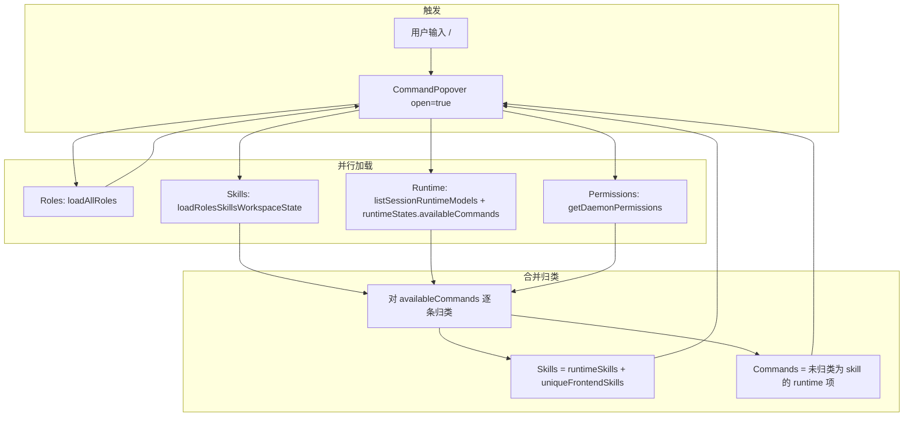

# `/` 弹窗：Roles / Skills / Commands 数据来源

桌面端（`packages/app/`）在聊天输入框输入 `/` 时，会打开 **CommandPopover**（`packages/app/src/components/chat/CommandPopover.tsx`）。弹窗分三组：

| 分组 | UI 图标 | 选中后写入输入框的 token |
|------|---------|--------------------------|
| **Roles** | 人像 | `/{role:<slug>}` |
| **Skills** | 闪电 ⚡ | `/{skill:<invocationName>}` |
| **Commands** | ⌘ | `/{command:<name>}` |

三组数据**并行加载**，加载完成后再做**合并与归类**。权限为 `deny` 的 skill 不会出现在列表中。

---

## 总览数据流



---

## 1. Skills（⚡）从哪里来

Skills **不直接**等于 daemon 的 `availableCommands`。主来源是 **workspace 磁盘扫描**（经 daemon HTTP API 或前端 FS 回退）。

### 1.1 加载入口

```
CommandPopover.scanAvailableSkills(workspacePath)
  → loadRolesSkillsWorkspaceState(workspacePath)   // packages/app/src/lib/roles/loader.ts
```

**Tauri 桌面端优先走 daemon：**

```
GET /v1/workspaces/{workspaceId}/roles-skills
  → amuxd scan_roles_skills_state()                // apps/daemon/src/config/roles_skills.rs
```

daemon 不可用时回退到前端 `loadRolesSkillsWorkspaceStateFromFs()`，内部调用 `loadAllSkills()`（`packages/app/src/lib/git/skill-loader.ts`）。

### 1.2 扫描哪些目录

每个 skill 对应 `<dir>/<skill-slug>/SKILL.md`。按优先级去重（同名 skill 高优先级覆盖低优先级）：

| 优先级 | 路径 | `source` 标记 |
|--------|------|---------------|
| 1 | `<workspace>/.teamclaw/skills/` | `local` / `builtin` / `clawhub` |
| 2 | `<workspace>/.claude/skills/` | `claude` |
| 3 | `<workspace>/.agents/skills/`（含嵌套 bundle，如 `superpowers/brainstorming`） | `shared` |
| 4 | `~/.config/teamclaw/skills/` | `global-teamclaw` |
| 5 | `~/.claude/skills/` | `global-claude` |
| 6 | `~/.agents/skills/` | `global-agent` |
| 7 | `<workspace>/.teamclaw/cache/agent/node_modules/*/skills/` | `plugin` |
| 8+ | **Team 共享路径**（见下表） | `team` |

**Team 共享 skill 目录**（`collectTeamSkillPaths`，`packages/app/src/lib/team-skill-paths.ts`）：

| 配置来源 | 示例 |
|----------|------|
| `teamclaw.json` → `skills.paths` | 自定义相对/绝对路径 |
| `opencode.json` → `skills.paths` | 如 `"teamclaw-team/skills"` |
| 默认目录（存在即用） | `<workspace>/teamclaw-team/skills` |

`teamclaw-team` 通常是 symlink，指向 `~/.amuxd/teams/<team-id>/teamclaw-team`。

另有 **Role 专属 skill**：`<workspace>/.teamclaw/roles/<role>/skills/<slug>/SKILL.md`（`isRoleSkill: true`）。

### 1.3 invocationName（选中后发送的名字）

由 `buildSkillInvocationName(parentDir, filename)` 决定（`skill-loader.ts`）：

- 父目录名是 `skills` → 仅用目录名，例如 `ai-keys`
- 父目录是 bundle 名 → `bundle/skill`，例如 `superpowers/brainstorming`

弹窗展示用 `SKILL.md` frontmatter 的 `name` 或标题；选中时写入 `invocationName`。

### 1.4 Skills 列表的最终组成

加载完成后分两部分合并（去重键 = `invocationName`）：

1. **runtimeSkills** — 来自 daemon `availableCommands`，但被归类为 skill 的项（见第 3 节）
2. **uniqueFrontendSkills** — workspace 扫描到、且未出现在 runtimeSkills 中的 skill

```
setSkills([...runtimeSkills, ...uniqueFrontendSkills])
```

### 1.5 刷新时机

- 每次打开 `/` 弹窗重新加载
- 监听 `SKILLS_CHANGED_EVENT`（设置页增删 skill 后触发），递增 `skillsRevision` 强制重载

---

## 2. Commands（⌘）从哪里来

Commands **只来自当前会话绑定的 agent runtime**，不是 workspace 文件扫描。

### 2.1 链路

```
1. Agent 进程（OpenCode / Claude Code / Codex）通过 ACP 上报
   SessionUpdate::AvailableCommandsUpdate

2. amuxd adapter 翻译为 AcpAvailableCommands
   apps/daemon/src/runtime/adapter.rs

3. RuntimeManager 缓存到 available_commands_per_agent
   apps/daemon/src/runtime/manager.rs

4. 写入 MQTT retain：amux/{teamId}/{actorId}/runtime/{runtimeId}/state
   payload: RuntimeInfo.availableCommands[]

5. 前端 runtime-state-store 解码并 upsert
   packages/app/src/stores/runtime-state-store.ts

6. CommandPopover 读取：
   getBackend().runtime.listSessionRuntimeModels(activeSessionId)  // 拿 runtime_id
   runtimeStates[runtime_id].info.availableCommands                   // 拿命令列表
```

### 2.2 会话无 runtime 时

`activeSessionId` 为空，或 `listSessionRuntimeModels` 无 `runtime_id` → **Commands 分组为空**。

### 2.3 OpenCode 的重要行为

OpenCode 会把 **skill 和内置 slash command 一起**放进 `availableCommands`（与 Claude Code 类似）。因此 raw 列表里往往同时包含：

- 内置命令：`clear`、`compact`、`help`、`model`、`cost` 等
- Team / workspace skill：`ai-keys`、`biz-code-delete` 等扁平名
- Bundle skill：`superpowers/brainstorming` 等带 `/` 的名字

**弹窗不会原样展示 raw 列表**，会先经过归类（第 3 节）。未归类为 skill 的项才进入 Commands，UI 显示为 `/name`。

---

## 3. availableCommands → Skills 还是 Commands？

归类逻辑在 `CommandPopover` 的 `Promise.all` 回调中，对每条 `availableCommands` 依次判断：

```
cmd from availableCommands
│
├─ 匹配 workspace skill？
│    skillByInvocation[cmd.name] 或 skillByFilename[cmd.name]
│    → runtimeSkills（使用扫描到的完整 SkillEntry）
│
├─ 名字像 namespaced skill？
│    正则：^[A-Za-z0-9._-]+(/[A-Za-z0-9._-]+)+$
│    例：superpowers/brainstorming
│    → runtimeSkills（仅用 runtime 描述构造临时 SkillEntry）
│
└─ 否则
     → runtimeCommands（显示在 Commands 分组）
```

### 3.1 常见误判场景

| 现象 | 原因 |
|------|------|
| `teamclaw-team` skill 出现在 **Commands** | 扁平名（无 `/`）且 workspace 扫描未命中同名 `invocationName` / `filename` |
| 本地 `.teamclaw/skills` 在 **Skills**，team skill 在 **Commands** | 本地扫描正常，但 team 路径未纳入 scan 或与 runtime 名不一致 |
| 带 `/` 的 bundle skill 总在 **Skills** | 命中 `looksLikeSkillInvocationName`，即使本地 scan 为空 |

### 3.2 权限过滤

`getDaemonPermissions(workspaceId)` 返回 skill 权限图；`resolveSkillPermission` 为 `deny` 的 skill 从允许列表剔除，归类时也会跳过。

---

## 4. Roles（人像）从哪里来

```
loadAllRoles(workspacePath)
  → loadRolesSkillsWorkspaceState(workspacePath).roles
```

扫描 `<workspace>/.teamclaw/roles/<slug>/ROLE.md`（及 daemon 返回的同等数据）。与 Skills 共用同一次 `roles-skills` API 响应。

选中后 token 为 `/{role:<slug>}`，与 skill/command 不同。

---

## 5. 选中后的行为

`ChatInputArea` → `CommandPopoverWrapper.handleSelect` → `insertSkillMention(name, type)`：

| type | 插入格式 |
|------|----------|
| `role` | `/{role:<slug>}` |
| `skill` | `/{skill:<invocationName>}` |
| `command` | `/{command:<name>}` |

发送时由 `ChatPanel` / `UserMessageWithMentions` 解析上述 token，交给 agent runtime 解释。

---

## 6. 相关代码索引

| 职责 | 路径 |
|------|------|
| `/` 弹窗 UI + 归类 | `packages/app/src/components/chat/CommandPopover.tsx` |
| 选中插入输入框 | `packages/app/src/components/chat/ChatInputArea.tsx` |
| Workspace skill 扫描 | `packages/app/src/lib/git/skill-loader.ts` |
| Team skill 路径聚合 | `packages/app/src/lib/team-skill-paths.ts` |
| Roles + Skills 聚合 API | `packages/app/src/lib/roles/loader.ts` |
| Daemon 扫描实现 | `apps/daemon/src/config/roles_skills.rs` |
| Runtime 命令缓存 | `apps/daemon/src/runtime/manager.rs` |
| ACP → protobuf | `apps/daemon/src/runtime/adapter.rs` |
| 前端 runtime 状态 | `packages/app/src/stores/runtime-state-store.ts` |
| 单测 | `packages/app/src/components/chat/__tests__/CommandPopover.test.tsx` |

---

## 7. 调试建议

打开弹窗时，`CommandPopover` 会打 `[CommandPopover]` 结构化日志，关键字段：

- `daemonCommandNames` — raw `availableCommands`
- `localSkillInvocations` — workspace 扫描到的 invocation 名
- `classified daemon command as known skill | namespaced skill | command` — 逐条归类结果
- `runtimeSkillCount` / `commandCount` — 最终两组数量

若 team skill 误入 Commands，依次检查：

1. `opencode.json` / `teamclaw.json` 的 `skills.paths` 是否包含 `teamclaw-team/skills`
2. `GET .../roles-skills` 返回的 skill 是否含对应 `filename` / `invocationName`
3. runtime 上报的 `cmd.name` 是否与 `invocationName` 一致（有无前导 `/`、是否用了 frontmatter `name` 而非目录名）
